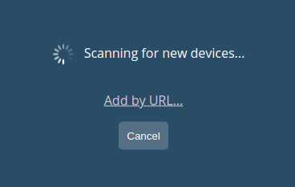
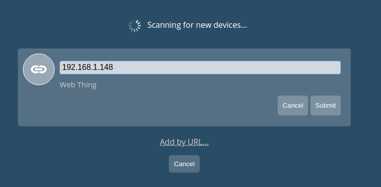
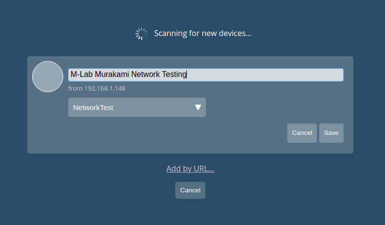
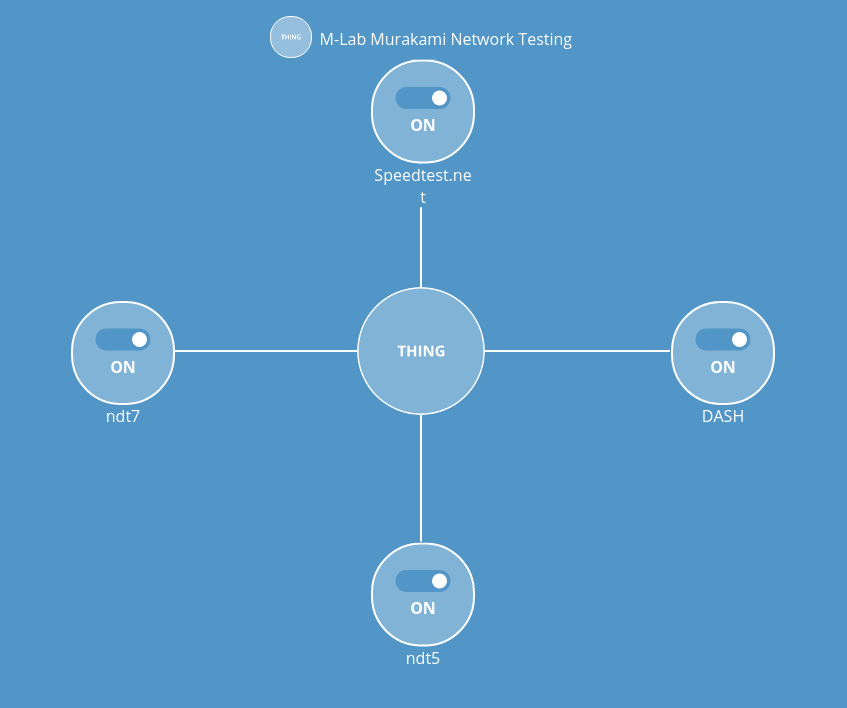

# Murakami Test Runners Managed by a Mozilla WebThings Gateway

The Murakami software can optionally advertise its test runners using as a
[Mozilla WebThing](https://iot.mozilla.org/framework/), allowing the runners to
be toggled on/off using a [Mozilla WebThings
Gateway](https://iot.mozilla.org/gateway/).

**Note that this feature is experimental, may not work for all test runners, and
may be deprecated in the future**

Follow the [instructions on Mozilla's site](https://iot.mozilla.org/gateway/) to setup a WebThings Gateway on the network where you wish to place Murakami measurement devices. If you prefer not to use a supported device (Raspberry Pi or Turris Omnia), you can [build the WebThings Gateway for other platforms](https://github.com/mozilla-iot/gateway).

## Installing Murakami

Installing Murakami is the same in this situation as the [standalone
installation](INSTALL-MURAKAMI-STANDALONE.md). To enable WebThings support, set
the environmen variable: `MURAKAMI_SETTINGS_WEBTHINGS` to `1` or `True`. Once
your device is running a Murakami container, your WebThings Gateway should be
able to detect and configure it.

## Configuring Murakami Devices Via a WebThings Gateway

Once you have a WebThings Gateway and at least one Murakami container running on
the same network, log into your WebThings Gateway to add each container as a
"M-Lab Murakami WebThing." You'll need to know the hostname or IP address for
each Murakami container.

On the "Things" page of the WebThings Gateway, click the + icon in the lower
right corner of the page to add a new Thing.

The Gateway will begin scanning for new devices. Click "Add by URL..."

Enter the IP address of the computer that is running the Murakami container and press "Submit".

Name your Murakami WebThing and leave “NetworkTest” selected in the drop down
menu, then click save. Once the message “Saved” appears, click “Done”.

The Murakami WebThing now appears in your list of Things.

Click on the small bubble in the upper right to access the Murakami WebThings
settings. The settings page displays all available test runners enabled in the
Murakami container, and allows you to toggle each on or off.

